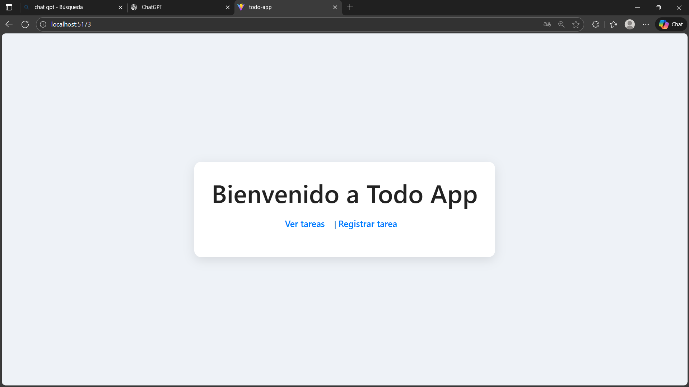
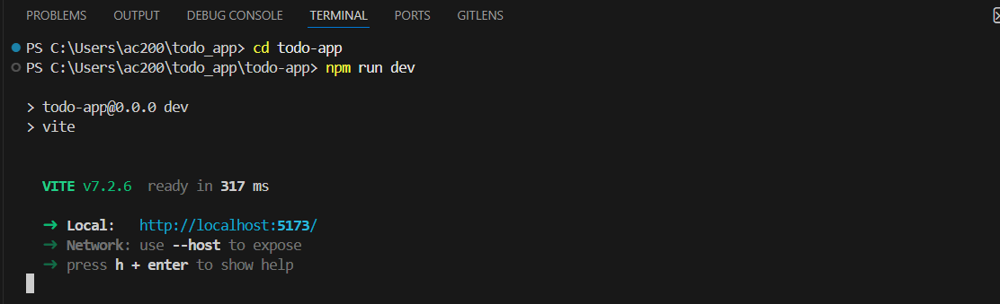

# todo_app
aplicacion de api y registro de tareas

# Aplicación de Gestión de Tareas (To-Dos)

## Descripción del Proyecto

Este proyecto es una aplicación de gestión de tareas (To-Dos) construida con **React**.  
Permite a los usuarios **registrarse, crear tareas, marcarlas como completadas, editarlas y eliminarlas**, utilizando una API externa para almacenar y obtener la información.

La aplicación está organizada en componentes reutilizables y páginas independientes, siguiendo buenas prácticas de React. También incluye manejo de estados, control de errores, validaciones básicas y pantallas de carga para mejorar la experiencia del usuario.

---

## Características principales

-  **Crear nuevas tareas** con validación básica  
-  **Listado dinámico de tareas** obtenido desde la API  
-  **Marcar tareas como completadas o pendientes**  
-  **Eliminar tareas** individualmente  
-  **Pantalla de registro de usuario**  
-  **Edición inicial de tareas (placeholder)**  
-  **Sistema de filtros (placeholder)**  
-  **Indicadores de carga (“loading”)**  
-  **Manejo de errores con try/catch**  
-  **Estructura modular y separada en componentes**

---

## Tecnologías utilizadas

- React (Vite)  
- JavaScript (ES6+)  
- Fetch API  
- CSS modularizado  
- React Router

---

## Estructura del proyecto

- `/components`: elementos reutilizables (TodoList, TodoItem, Loader, filtros, etc.)  
- `/pages`: pantallas principales (Home, Todos, Register, EditTodo)  
- `/api.js`: funciones para comunicación con la API  
- Archivos de estilos globales

---
## Commist del proyecto e interfaz de navegador



## Instalación

1. Clona este repositorio:

   ```bash
   git clone <url-del-repositorio>
  luego se debe entrar en la carpeta del proyecto con 
  cd (nombre del proyecto)
  e instala npm install para el funcioanmiento del proyecto
  y por ultimo en el terminal de visual debes correr el proyecto con el comando 
  npm run dev, y entrar en el link que te arroja con control + click

